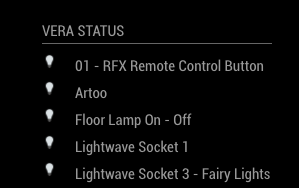

# MMM-MiOSView #
Additional Module for MagicMirror²  https://github.com/MichMich/MagicMirror

Alpha Concept - Unsupported - this is for example only

# Module: MiOS View #
This module displays information from a local MiCasa Verde Vera HA controller.



## Using the module ##

Git clone from this repository into the modules sub-directory of the Magic Mirror installation, change directory into the newly cloned code and then run npm install.

```bash
git clone https://github.com/nwootton/MMM-MiOSView.git
cd MMM-MiOSView
npm install
```
To use this module, add it to the modules array in the `config/config.js` file:

```javascript
modules: [
    {
		module: 		'MMM-MiOSView',
		position: 		'bottom_left',
		header:			'Vera Status',		//Optional - delete this line to turn OFF the header completely
		config: {
			veraURL:	'192.168.1.159' 		// IP address of local Vera box
		}
	},
]
```
There is 1 MANDATORY field - `veraURL` this is the IP address of the Vera device on the local network.

## MiOS API ##

This module assumes that the Vera device is on the same network as the Mirror. It does not support access via MCV forwarding servers.

## Translations ##

This module includes translations. I've included English and German, but the German is purely a Google Translate of the English, so I apologise to any German speakers! Feel free to add additional languages and to change or ping me with corrections.

## Troubleshooting ##

Unsupported concept - I only have access to a Vera Lite running UI5, so any issues resulting from using other Vera boxes or UI versions I am unable to support.
